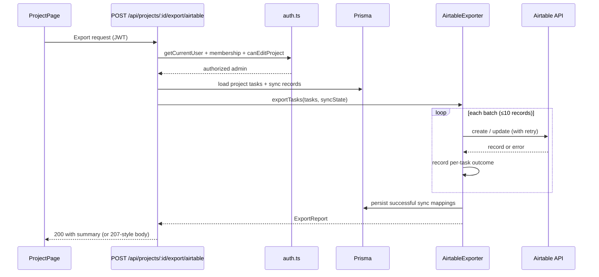
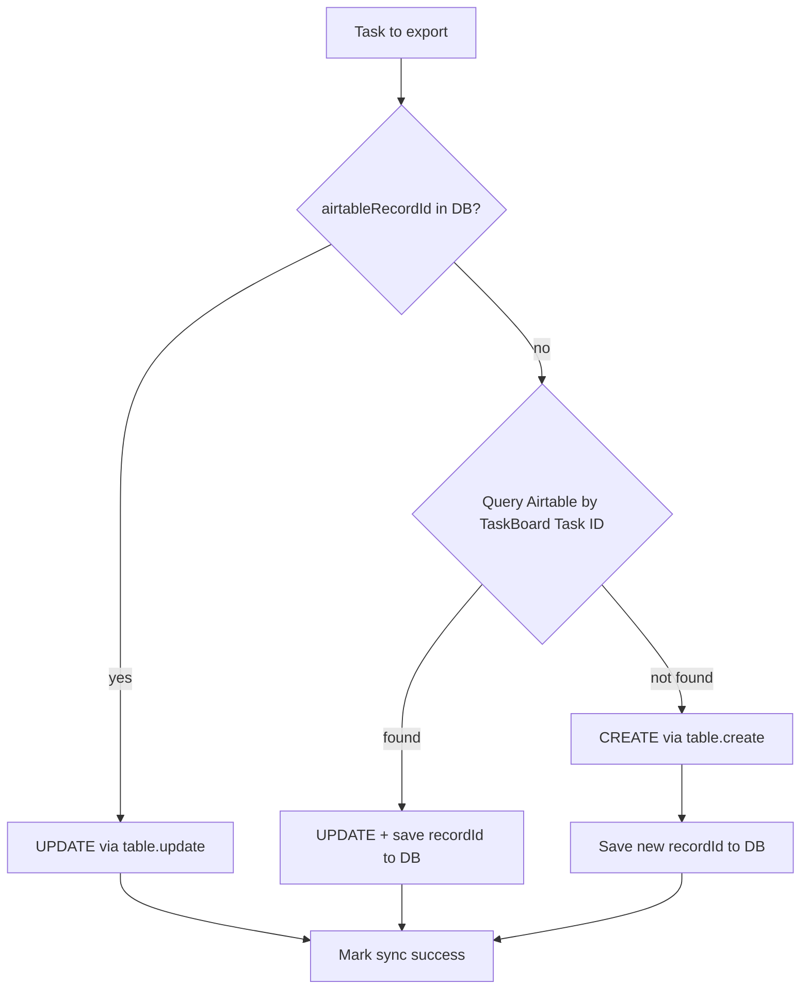

# Design Notes

## Airtable Export Architecture

**Status:** Design only — not implemented  
**Goal:** Export project tasks from TaskBoard (PostgreSQL/Prisma) to Airtable using the official `airtable` npm package (`0.12.2`, already in `package.json`).

---

### Requirements mapping

| Requirement | Approach |
|-------------|----------|
| Official `airtable` package | Thin wrapper in `src/lib/airtable/client.ts` around `Airtable.base(baseId).table(tableName)` |
| Real API calls | Server-side only (Route Handler); credentials from env, never sent to browser |
| Duplicate-safe | External key field + persisted `airtableRecordId` mapping per task |
| Retries | Shared retry helper with exponential backoff on 429 / 5xx / network errors |
| Partial failure | Per-task result collection; commit sync state for successes; return mixed-status report |

---

### High-level flow



---

### Layered architecture

```
src/
├── app/api/projects/[id]/export/airtable/
│   └── route.ts                 # HTTP boundary: auth, validation, response
├── lib/airtable/
│   ├── client.ts                # Official package wrapper (singleton, env config)
│   ├── config.ts                # Env validation (API key, base ID, table name)
│   ├── mapper.ts                # Task → Airtable field payload
│   ├── retry.ts                 # withRetry(fn, options)
│   ├── batch.ts                 # Chunk array, rate-limit spacing between batches
│   ├── exporter.ts              # Orchestrator: classify, execute, aggregate results
│   └── types.ts                 # AirtableFieldMap, ExportResult, ExportReport
└── lib/airtable-mock.ts         # Existing test double — keep for unit tests
```

**Principle:** Route Handler stays thin. All Airtable logic lives under `src/lib/airtable/`. Tests mock at the `client` or `exporter` boundary; integration tests can use `airtable-mock`.

---

### Trigger & authorization

**Endpoint:** `POST /api/projects/:id/export/airtable`

| Check | Rule | Rationale |
|-------|------|-----------|
| Authentication | `getCurrentUser` → 401 | Consistent with existing routes |
| Membership | `getProjectMembership` → 403 | Must belong to project |
| Role | `canEditProject` (admin only) | Export is a write-side-effect to external system; align with project DELETE/PATCH |

Optional request body (future): `{ taskIds?: string[] }` to export a subset. Default: all tasks in project.

**UI placement:** Primary action button on `src/app/projects/[id]/page.tsx`, in the project header area (alongside existing inline sections). Uses existing button patterns: accent primary, `disabled` while pending, error via `role="alert"`.

---

### Airtable table schema (target base)

Define these columns in the Airtable **Tasks** table (`AIRTABLE_TABLE_NAME`, default `"Tasks"`):

| Airtable field | Source | Notes |
|----------------|--------|-------|
| `TaskBoard Task ID` | `task.id` | **Idempotency key** — single-line text, unique |
| `Title` | `task.title` | |
| `Description` | `task.description` | Long text |
| `Status` | `task.status` | Single select matching enum values |
| `Project ID` | `task.projectId` | Single-line text |
| `Project Name` | `project.name` | Lookup context for humans |
| `Assignee Email` | `task.assignee?.email` | Optional |
| `Assignee Name` | `task.assignee?.name` | Optional |
| `Position` | `task.position` | Number |
| `Created At` | `task.createdAt` | ISO string |
| `Updated At` | `task.updatedAt` | ISO string |
| `Last Synced At` | server timestamp | Set on each successful export |

The official SDK does **not** allow setting Airtable record IDs (`rec…`) on create. Duplicate safety relies on `TaskBoard Task ID`, not on CUID-as-record-id (the mock's `id` upsert pattern is test-only).

---

### Duplicate-safe strategy (idempotent export)

Two-phase identity resolution:



**Persistence — new Prisma model (recommended):**

```
TaskAirtableSync
  taskId          String   @id          -- FK to tasks.id
  airtableRecordId String              -- recXXXXXXXX
  lastSyncedAt    DateTime
  lastError       String?              -- cleared on success
  task            Task     @relation(...)
```

- One row per task max → re-export updates the same Airtable row.
- First export: CREATE. Subsequent exports: UPDATE same record.
- If DB row missing but Airtable row exists (manual DB wipe): recover via filter query on `TaskBoard Task ID` before creating.

**Filter query for recovery (official SDK):**

```text
filterByFormula: {TaskBoard Task ID} = '<task.id>'
```

Run once per task only when no local mapping exists (or batch formula with `OR()` for small sets). Prefer local mapping for steady-state performance.

---

### Official client wrapper

`src/lib/airtable/client.ts` responsibilities:

- Read `AIRTABLE_API_KEY`, `AIRTABLE_BASE_ID`, `AIRTABLE_TABLE_NAME` from env.
- Fail fast at call time if credentials missing (not at module import — keeps tests working).
- Expose a narrow interface (not raw SDK everywhere):

| Method | SDK call | Purpose |
|--------|----------|---------|
| `createRecord(fields)` | `table.create(fields, { typecast: true })` | New task |
| `updateRecord(recordId, fields)` | `table.update(recordId, fields, { typecast: true })` | Existing task |
| `findByTaskBoardId(taskId)` | `table.select({ filterByFormula, maxRecords: 1 })` | Recovery / dedup |

Use `{ typecast: true }` so select options are auto-created if missing.

**Why wrap:** Centralizes SDK version, enables mock injection in tests, single place for retry invocation.

---

### Batching & rate limits

Airtable REST limits (per base):

- **5 requests / second**
- Batch create/update: up to **10 records per request** (SDK `table.create([...])` / `table.update([...])`)

**Batch strategy:**

1. Classify each task as `create` or `update` (with resolved `airtableRecordId`).
2. Group into chunks of ≤10 per operation type.
3. Process batches sequentially with ≥200ms spacing (or adaptive delay after 429).
4. Within a batch, use SDK batch methods where possible; fall back to single-record calls if batch partial-failure semantics are unclear.

`src/lib/airtable/batch.ts`:

- `chunk<T>(items, size)` → arrays of ≤10
- `processSequential(batches, fn, delayMs)` → respects rate limit

---

### Retry policy

`src/lib/airtable/retry.ts` — generic `withRetry(operation, options)`:

| Error | Retry? | Backoff |
|-------|--------|---------|
| HTTP 429 (rate limit) | Yes | `Retry-After` header if present, else exponential: 1s → 2s → 4s + jitter |
| HTTP 5xx | Yes | Exponential backoff, max 3 attempts |
| Network timeout / ECONNRESET | Yes | Same as 5xx |
| HTTP 4xx (except 429) | No | Fail immediately — bad field name, auth, etc. |
| 404 on update | No | Treat as stale mapping → clear DB recordId → re-classify as create on next pass |

**Defaults:** `maxAttempts: 3`, `baseDelayMs: 1000`, `maxDelayMs: 8000`.

Retries apply **per record** (or per batch if batch API returns atomic failure). If a batch fails entirely, retry the batch; if SDK exposes per-record errors, split and retry only failures.

---

### Partial failure support

Export is **best-effort per task**, not all-or-nothing.

**Internal result type:**

```typescript
type TaskExportOutcome =
  | { taskId: string; status: "created"; airtableRecordId: string }
  | { taskId: string; status: "updated"; airtableRecordId: string }
  | { taskId: string; status: "failed"; error: string };

type ExportReport = {
  projectId: string;
  total: number;
  created: number;
  updated: number;
  failed: number;
  results: TaskExportOutcome[];
  syncedAt: string;
};
```

**Orchestrator behavior (`exporter.ts`):**

1. Iterate all tasks; wrap each in try/catch (or collect SDK errors).
2. On success → upsert `TaskAirtableSync`, clear `lastError`.
3. On failure → set `lastError` on sync row if exists; do **not** roll back other tasks.
4. Return full `ExportReport`.

**HTTP response:**

- All succeeded → `200` + report
- Mixed → `200` + report with `failed > 0` (prefer 200 over 207 for simplicity in TanStack Query; UI reads `failed` count)
- Auth/config failure → `401` / `403` / `503` (misconfigured Airtable creds)

**UI feedback on project page:**

- Success toast/alert: `"Exported 12 tasks (2 updated, 10 created)"`
- Partial: `"Exported 10 of 12. 2 failed — see details."` with expandable error list
- Uses existing `text-red-400` + `role="alert"` pattern from add-task form

---

### API integration (frontend)

| Operation | Method | Endpoint | Query key invalidation |
|-----------|--------|----------|------------------------|
| Export to Airtable | `POST` | `/api/projects/:id/export/airtable` | None required (tasks unchanged); optional `["project", id]` if UI shows sync status later |

Mutation pattern (matches existing `createTask` / `updateTask`):

- `useMutation` → `apiFetch`
- `onSuccess`: display report summary in local state
- `onError`: show API error message
- Button: `disabled={exportMutation.isPending}`, label `"exporting…"` while pending

---

### Testing strategy

| Layer | Tool | What it proves |
|-------|------|----------------|
| Mapper unit tests | Vitest | Field mapping correct for all task shapes |
| Retry unit tests | Vitest | Backoff, max attempts, no retry on 4xx |
| Exporter unit tests | Vitest + `airtable-mock` | Idempotency, partial failure, stale record recovery |
| Route handler tests | Vitest + mocked exporter | Auth gates (401/403), happy path returns report |
| Client wrapper | Optional integration | Real API — manual / CI secret, not in default `npm test` |

Keep `airtable-mock.ts` for fast tests. Production code imports `src/lib/airtable/client.ts`, never the mock.

**Key test cases:**

1. First export → all `created`, DB mappings written
2. Second export → all `updated`, no duplicate Airtable rows
3. One task fails mid-batch → others succeed, report shows `failed: 1`
4. Simulated 429 → retries then succeeds (`__setFailureRate` on mock)
5. Viewer calling export → 403

---

### Environment variables

Already in `.env.example`:

```env
AIRTABLE_API_KEY=""        # Personal access token
AIRTABLE_BASE_ID=""        # appXXXXXXXX
AIRTABLE_TABLE_NAME="Tasks"
```

Validate in `config.ts` when export is invoked. Missing vars → `503` with `"airtable not configured"` (do not expose which var is missing in production).

---

### Security considerations

- API key **server-only** — Route Handler runs on server; never import Airtable client in `"use client"` components.
- Export restricted to **project admins** — prevents viewers from pushing data to external systems.
- Do not log API key or full Airtable payloads in production.
- `TaskBoard Task ID` in Airtable exposes internal CUIDs — acceptable for sync; do not export `passwordHash` or other sensitive user fields (mapper uses assignee name/email only).

---

### Implementation order (suggested)

1. Prisma migration: `TaskAirtableSync` model
2. `config.ts` + `client.ts` + `mapper.ts`
3. `retry.ts` + `batch.ts`
4. `exporter.ts` (core orchestration)
5. `POST /api/projects/:id/export/airtable` route
6. Unit tests (mapper, retry, exporter with mock)
7. Route auth tests
8. Project page export button + report UI

---

### Out of scope (v1)

- Scheduled / background exports (cron, queue)
- Two-way sync (Airtable → TaskBoard)
- Webhook on Airtable changes
- Exporting projects or memberships (tasks only)
- Real-time progress streaming (SSE) — v1 returns report after completion
